# Speed-Dating
This project is about prediction of whether the participant of a date decide to give his/her partner a second date after a short experimental Speed Dating event. I have implemented my own version machine learning algorithms from <ins>scratch using python</ins> without the use of any publicly available libraries like scikit-learn or scipy.

### <ins>Table of contents</ins>:
  - [ Data Description ](#desc)
  - [ EDA ](#eda)
  - [ **Machine Learning models**](#nbc)
    - [ Naive Bayes Classifier ](#nbc)
    - [ Logistic regression Classifier ](#lr)
    - [ Support Vector Machine ](#svm)
    - [ Decision Tree ](#tree)


<a name="desc"></a>
### Data description:
The dating dataset consists of 6744 speed dating events in the comma-separated format(experimental dataset).In this set of speed dating experiments, each speed date happens between a pair of participants.

Before the speed date, each participant has been asked to indicate a number of preferences in their romantic partner (e.g., how important it is for the romantic partner to come from the same racial/religious background as themselves, allocate points among the six attributes “attractiveness”, “sincerity”, “intelligence”, “fun”, “ambition”, “shared interests” to indicate how much they value each attribute in their romantic partner, etc.). They also provide some
information about themselves such as their self-evaluation on the six attributes (i.e.,“attractiveness”, “sincerity”, “intelligence”, “fun”, “ambition”, “shared interests”) and
their levelof interests in a wide range of activities (e.g., museum, arts, dinning, etc.).

During the speed date, the pair of participants in a date chat with each other for 2 minutes, andeach participant provides some evaluations for their partner, including ratings of their partner onthe six attributes (i.e., “attractiveness”, “sincerity”, “intelligence”, “fun”, “ambition”, “sharedinterests”), ratings on how happy they expect it to be if they continue romantic relationships withtheir partner, and ratings on how much they like their partner.At the end of the speed date, each participant in a date makes a decision of whether he/she wants to give their partner a second date. For detailed description of data, look at the [ table ](#table) 

<a name="eda"></a>
### Exploratory Data Analysis:
| 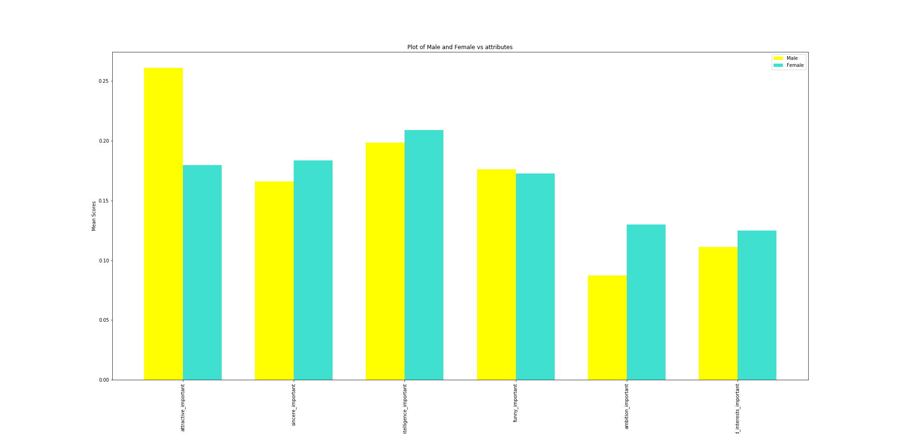 | 
|:--:| 
| *Bar Plot of Male vs Female attributes* |

| 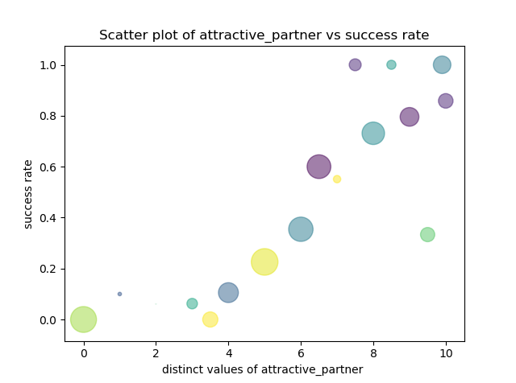 | 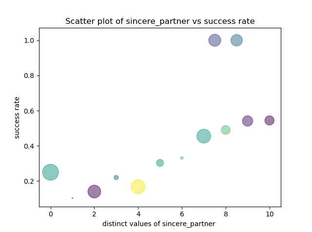 | 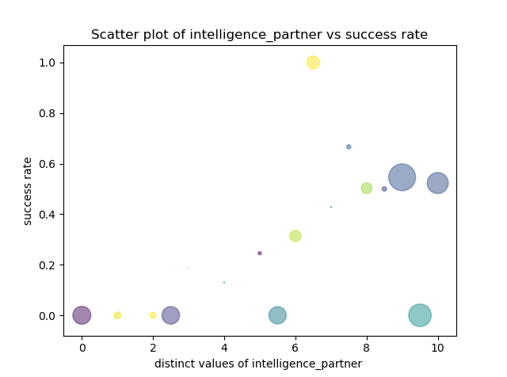
|:--:|:--:| :--: 
| *attractive partner vs success rate* | *sincere partner vs success rate* | *intelligence partner vs success rate* 

| 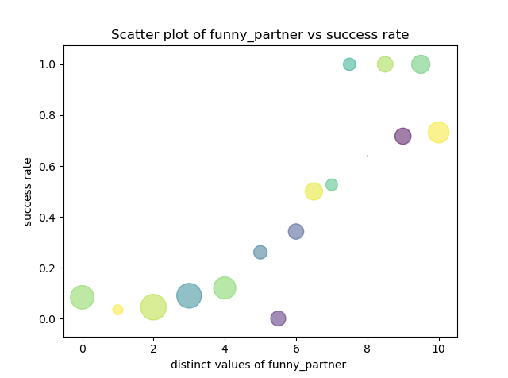 | 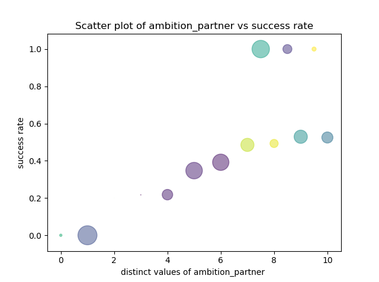 | 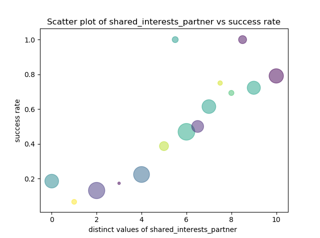
|:--:|:--:| :--: 
| *funny partner vs success rate* | *ambition partner vs success rate* | *shared_interest partner vs success rate* 

<a name="nbc"></a>
### Naive Bayes Classifier:
Naive Bayes classifier is a probabilistic machine learning model that’s used for classification task based on the Bayes theorem.
 
 
```
nbc=classifier(trainingSet,testSet)
nbc.nbc(tfrac)
nbc.predict(test/train)
```

The pseudo code for the nbc algorithm is:
  - Memorize the training data
  - calculate mean and sd of predictor variables in each class
  - Repeat
    - Calculate prior probability until probability of all predictor variables are found
  - Apply Laplacian Smoothing
  - Calculate likelihood of each class
  - Pick the argmax of likelihood
  
The algorithm acheieved a training and testing accuracy of **77 percent** and **75 percent** respectively and the training and validation plots are shown below.

| 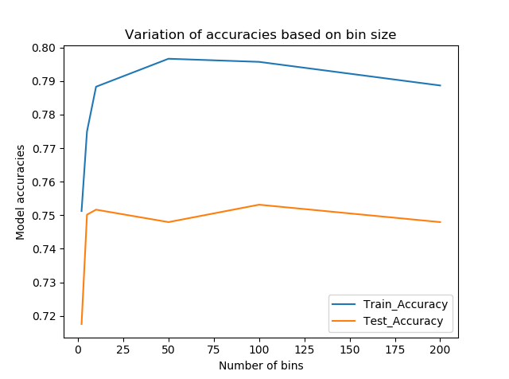 |  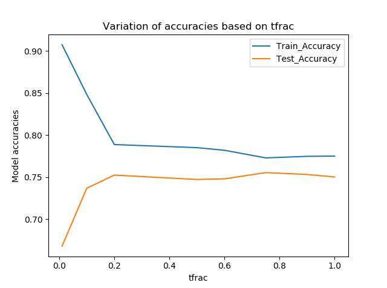
|:--:| :--:
| *Accuracy variation over varied bin size* | *Accuracy variation over fraction of training data*

<a name="lr"></a>
### Logistic regression classifier:
Logistic regression is a statistical model that in its basic form uses a logistic function () to model a binary dependent variable

The pseudo code for the Logistic regression algorithm is:
  - Seperate label and features
  - Add Intercept and map labels in range[-1,1]
  - Initialize weights
  - Repeat
    - Compute 
    - Calculate loss 
    - Update weights
  - Stop Iteration after convergence

```
lr(trainingSet,testSet,stepSize,maxIterations,threshold,lamda)
```
The algorithm acheieved a training and testing accuracy of **72 percent** and **70 percent** respectively and the training and validation plots are shown below.


<a name="svm"></a>
###  Support Vector Machine:
A Support Vector Machine is a discriminative classifier formally defined by a separating hyperplane

The pseudo code for the SVM algorithm is:
  - Load training data 
  - set value for C
  - Repeat
    - For all  optimize  
  - Stop Iteration after convergence
  -Retain support vectors 0">

```
svm(trainingSet,testSet,stepSize,maxIterations,threshold,lamda)
```
The algorithm acheieved a training and testing accuracy of **78 percent** and **73 percent** respectively and the training and validation plots are shown below.

| 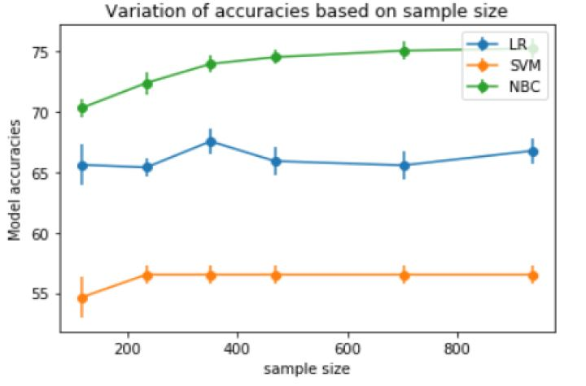 | 
|:--:| 
| *Comparison of Accuracies over various algorithms* | 

<a name="tree"></a>
### Decision Tree:
I have implemented the decision tree algorithm for multinomial classification problems and also used ensemble methods like bagging and random forests to boost the performance of the classifier.

pseudo code for the Decision tree algorithm:
  - Build Tree recursively
    - If training example = null, return
    - if examples have same label. return the leaf node with resp label
    - if attributes=null, return leaf node with majority label
    - Choose the best attribute based on chosen method
    - create internal node of best attribute with n child
    - for attribute's ith possible value
      - recurse(best attribute of ith child of chosen attribute
      
Attribute Selection criteria used:
  - gini gain
  - chi square score
  - Information Gain
  
Pruning Methods applied:
  - Post-pruning:Seperated data into training data and validation data and grew a tree followed by pruning to eliminate nodes from tree
  - Pre pruning:Applied the mentioned statistical test to decide whether to expand a node and added a penalty to score function to prefer trees with smaller size.

Obatined a training accuracy of **84 percent** and a testing accuracy of **80 percent** for the multinomial decision tree classifier built.

```
obj=tree(trainingSet,testSet,maxDepth=8,exampleLimit=50,decisionVar='decision',vectorised=False)
modelIdx=int(input("Enter model index : eg.1 or 2 or 3"))
    if modelIdx==1:
        decisionTree(trainingSet,testSet)
    elif modelIdx==2:
        bagging(trainingSet,testSet)
    elif modelIdx==3:
        randomForests(trainingSet,testSet)
    else:
        print("Invalid Input")
```

#### Ensemble models:

In addition to the implementation of decisioin tree, I included ensemble models like bagging and random forests to improve the performance and obtained a training accuracy of **87 percent** and testing accuracy of **85 percent** for Random forests model which was the best model obtained.

| 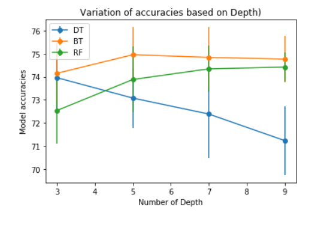 |  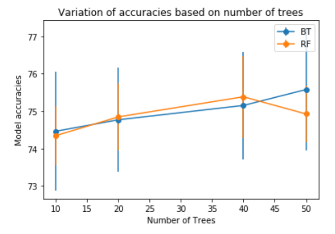
|:--:| :--:
| *Accuracy based on varying depth* | *Accuracy based on varying number of trees*


<a name="table"></a>
### Data features
| Field | Meaning |
| ----------- | ----------- |
| gender | gender of participant | 
| age | age of participant | 
| age_o | age of partner | 
| race | race of participant | 
| race_o | race of partner | 
| same_race | whether participant and partner belong to same race |
| importance_same_race | participant rating on importance of two people to be of same race | 
| importance_same_religion | participant rating on importance of two people to be of same religion | 
| field | participant's field of study |
| pref_o_attractive | partner's allocated point on attractiveness | 
| pref_o_sincere | partner's allocated point on sincere | 
| pref_o_intelligence | partner's allocated point on intelligence | 
| pref_o_funny | partner's allocated point on funny | 
| pref_o_ambitious | partner's allocated point on ambitious | 
| pref_o_shared_interests | partner's allocated point on shared_interests | 
| attractive_important | participant's allocated point on attractiveness | 
| sincere_important | participant's allocated point on sincereness | 
| intelligence_important | participant's allocated point on intelligence | 
| funny_important | participant's allocated point on being funny | 
| shared_interests_important | participant's allocated point on shared interests | 
| ambition_important | participant's allocated point on being ambitious | 
| attractive | participant self rating on attractiveness
| sincere | participant self rating on sincere
| intelligence | participant self rating on intelligence
| funny | participant self rating on funny
| ambition | participant self rating on ambition
| attractive_partner | participant  rating on partner's attractiveness
| sincere_partner | participant rating on partner's sincere
| intelligence_partner | participant rating on partner's intelligence
| funny_partner | participant rating on partner's funny
| ambition_partner | participant rating on partner's ambition
| shared_interests_partner | participant rating on partner's shared_interests
| sports | participant self rating on interest in sports
| Tvsports | participant self rating on interest in Tvsports
| Exercise | participant self rating on interest in exercise
| dining | participant self rating on interest in dining
| museums | participant self rating on interest in museums
| art | participant self rating on interest in art
| hiking | participant self rating on interest in hiking
| gaming | participant self rating on interest in gaming
| clubbing | participant self rating on interest in clubbing
| reading | participant self rating on interest in reading
| Tv | participant self rating on interest in Tv
| Theater | participant self rating on interest in theater
| movies | participant self rating on interest in movies
| concerts | participant self rating on interest in concert
| music | participant self rating on interest in music
| shopping | participant self rating on interest in shopping
| yoga | participant self rating on interest in yoga
| interests_correlate | correlation b/w participant and partner rating in interests
| expected_happy_with_sd_people | participant's rating on how happy he/she expects to be with partner |
| like | participant's rating on how much he/she likes partner
| decision | participant's decision on whether he/she would like to see date in future


